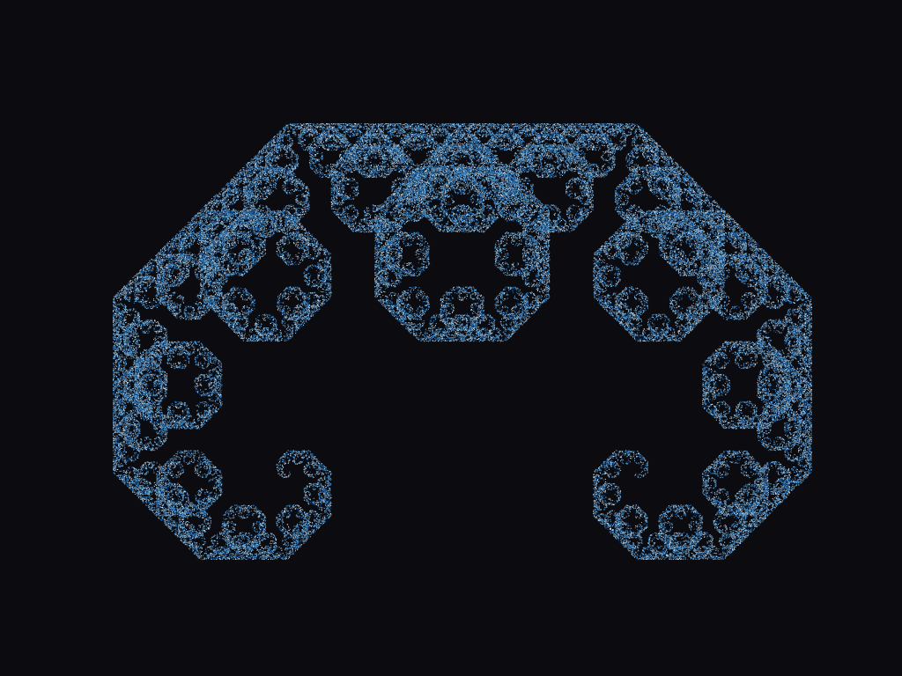

# FRACTALS

## simple fractal playground for learning purposes
# goals:
1. make a fractal visualizer using mathplotlib and numpy 
2. learn how to use both libraries
3. move to tkinter later
4. learn wpf using c#
5. build up to ascii animation in terminal using c 

## requirements:
python3
matplotlib
numpy
tkinter
